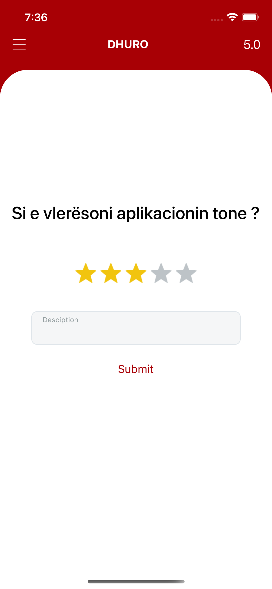

# DHURO - Mobile Application

This app was conducted at the Faculty of Electrical and Computer Engineering as the topic of the bachelor's degree.

## Usage

“Dhuro” project’s target is to handle donations and connect the donors with the nearest/most appropriate persons in need through a social mobile application. 
This application aims to help our society create a sense of solidarity through modern techniques.

## Screenshots
&nbsp; &nbsp; 
&nbsp; 
&nbsp;&nbsp; 

## Developed with
- Backend : Server with NodeJS (Express), Database connection PostgreSQL(knex.js), File upload with Multer

- Frontend : React Native

## Developed by

- Flutura Haxhaj
